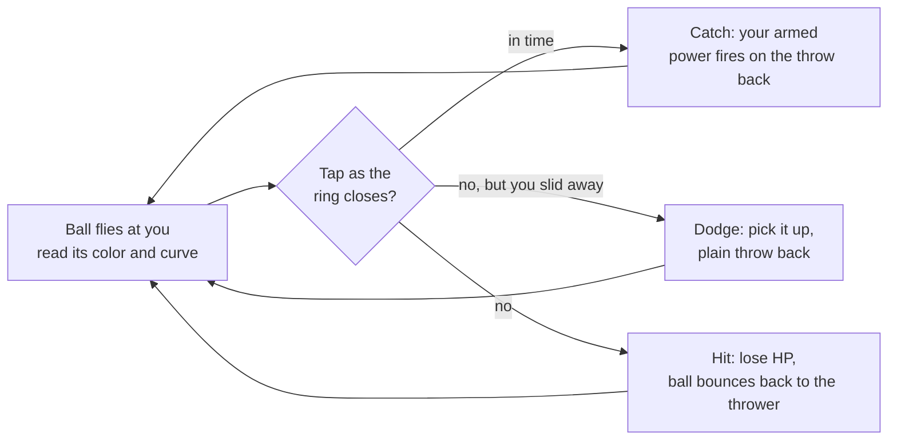

# Chroma Clash — Game Design Doc

Sep 24, 2026 · @Rodrigo

## Overview

Chroma Clash is a fast neon 1v1 ball duel for phones, where a ball never stops bouncing between two players and every catch fires a power from a color-based card deck. It crosses Brazilian queimada (dodgeball) with Pong and a Magic the Gathering-style color system.

**Pillars**

- **Flow:** the ball never stops or resets, and speed only climbs. Players must stay focused the whole duel.
- **Read and react:** the incoming ball's color tells you what's coming; you arm the right answer and catch.
- **Identity through color:** each card color has a distinct personality, so your deck defines your playstyle.
- **Intensity:** neon light, flashes and particles make every catch and hit feel big.

**Platform:** mobile browser, touch-first. It's a website, with nothing to install.

**Scope:** the MVP is a single-player roguelike against AI rivals, running fully client-side with no server. Online 1v1 against real players (lobby and invites) is the follow-up, built on the same game core.

## Prototypes in test (core loop not final)

Playtests showed the lane-based rally still read as Pong: one ball taking turns, one predictable threat, and powers that were hard to see. Two real-time prototypes are on the menu to compare on a phone. Both use 2D movement in the whole court, the deck builder, and a power card panel that always shows your power and what it does.

- **A · Strike (shared arena):** one loose ball bouncing off all four walls. Drag to move anywhere; tap while the ball is inside your ring to strike it at the rival (it leads them and curves by card). Your struck ball hurts the rival on contact and theirs hurts you; after a hit, or three wall bounces, the ball goes neutral and whoever reaches it next strikes it. Three strikes charge your meter, and the next strike fires your power card. The rally speed only climbs.
- **B · Dodgeball (three balls):** three balls start on the midline. Walk over a ball on your side to grab it; it is loaded with your next power card. Tap to throw it (aimed at the rival, curve-corrected). With empty hands, touch as a ball reaches you to catch it: you keep it and the thrower takes 6 damage. Hits and misses drop the ball on the target's side, so balls keep flowing both ways and both players act at once.

The sections below describe the earlier lane-based design and will be rewritten once a prototype is chosen.

## Core loop and flow

A duel is dodgeball, one on one: every throw is aimed at your body. You either catch it, dodge it, or take the hit.

- **The ball hunts you:** for the first half of its flight it turns to chase you, so moving early is pointless. Then it *commits*: it stops chasing, releases its curve, and flies to a point on your body but off your hands. A landing marker appears on your line at that moment (pink = it will hit your body, bright = it's in your hands).
- **Catch (high reward):** slide so the marker is in your hands, then tap just before impact. A timing ring closes on you as the ball arrives; tapping in its last moment is a perfect catch (+25% damage). Tapping too early fumbles: your hands drop, there is a short cooldown, and the ball usually hits you.
- **Dodge (safe):** slide out of the ball's path. You take no damage, but you only pick the ball up off the back wall and throw it plain, with no power.
- **Hit:** the ball deals its damage and bounces straight back at the thrower, who must now catch or dodge it. The ball never resets to center.
- **Speed ramp:** each duel starts genuinely slow so everything is readable, then speed climbs with every throw and with time. It never drops back within a duel.
- **Duel length:** about 3 to 5 minutes, driven by the speed ramp rather than a timer.

## Controls

Touch only: slide to move (and dodge), tap to catch.

| Action | Gesture | Notes |
| --- | --- | --- |
| Move / dodge | Keep a thumb on the screen and slide left or right | Player follows the thumb like a slider |
| Catch | Slide under the landing marker, then tap anywhere (a second finger works while sliding) | Only counts while a ball is close; only your hands (the chevron's center) catch |
| Arm a power | Tap one of the three pips at the bottom | Desktop: 1/2/3 or Q/E to cycle |
| Throw | Automatic | A catch throws back at the rival's body with the armed power |

- **Power slots:** you hold up to 3 powers, shown as three glowing pips at the bottom of the screen.
- **Color feedback:** the whole world (court lines, dots, your glow) shifts to the armed power's color, so you never need to look at the UI.
- **Refill:** a thrown power is spent, and its slot refills with the next card from your deck.
- **Aim is automatic:** every throw chases the target, then commits to land on their body but off their hands. The skill is reading the committed curve, sliding under it and timing the tap; standing still gets you hit.
- **Curved flight:** catching off-center or while moving adds curve, every throw gets a little spin, and cards add big arcs, S-bends and zigzags.

## Color system

All five colors ship in the MVP, each with its own 8-card deck to draft from.

| Color | Name | Identity |
| --- | --- | --- |
| Red | Surge | Raw speed and damage |
| Blue | Phase | Curves and tricks, hard to read |
| Black | Void | Drain and sacrifice, power at a price |
| Green | Growth | Momentum that scales over a rally |
| White | Aegis | Shields, slowing and control |

**Counter wheel:** each color beats the next around the circle: Red > Blue > Black > Green > White > Red. (This keeps Red > Blue > Black from the original triangle; Black no longer beats Red.) Catching an incoming ball with the power that counters its color cancels the incoming effect and adds bonus damage to your throw.

**Charge and ultimates:** throwing the same color three times in a row unleashes that color's ultimate.

- **Red, Overdrive:** the ball bursts to maximum speed with double damage.
- **Blue, Prism:** the throw splits into three balls, only one of them real.
- **Black, Eclipse:** drains a chunk of the rival's HP to you.

This creates the deck-building tension: a mono-color deck charges ultimates reliably but has a known weakness, while a two-color deck is more flexible but charges less often.

## Deck building (meta layer)

Before every duel you build your deck from the full pool, and it is saved on your device between sessions.

- **Pool:** five color decks of 8 cards each (40 cards). The authoritative list with numbers lives in `src/core/cards.ts`.
- **Your deck:** 3 to 7 unique cards, from any mix of colors. A 3-card deck keeps the same three powers in your slots all duel; a bigger deck cycles through more options but is less predictable to manage.
- **Rivals:** each rival has a color identity (shown as "VS VOID" before the serve) and a 5-card deck: four of its color plus one off-color card.
- **Record:** wins, losses and top rally speed are tracked on the menu.
- **Later:** unlocks (start with a subset of the pool and earn the rest), rarity limits, and the roguelike run's card rewards feed into the same collection.

## Cards

The original 12-card set (below) is now part of the 40-card pool; Green and White and extra Red/Blue/Black cards were added with the deck-building update. Damage numbers are starting values to tune in playtesting.

| Card | Color | Rarity | Damage | Effect |
| --- | --- | --- | --- | --- |
| Fastball | Red | Common | 12 | 40% faster throw |
| Heavy | Red | Common | 22 | Slower, leaves a thick wake and shakes the screen |
| Cannon | Red | Rare | 30 | Fast and heavy |
| Overheat | Red | Uncommon | 15+ | More damage the faster the ball is; costs you 5 HP |
| Curve | Blue | Common | 14 | Bends in the air |
| Zigzag | Blue | Uncommon | 14 | Snaps side to side like lightning |
| Ghost | Blue | Rare | 15 | Flickers and fades mid-court |
| Split | Blue | Uncommon | 12 | Throws a decoy ball alongside the real one |
| Leech | Black | Common | 12 | Heals you 10 if it lands |
| Hex | Black | Uncommon | 10 | Rival's next armed power fizzles |
| Sacrifice | Black | Rare | 35 | You lose 15 HP to throw it |
| Shade | Black | Common | 12 | Dims the arena lights briefly for the rival |

New players start with a 5-card deck (Fastball, Curve, Leech, Sprout, Guard), one of each color, and can edit it freely.

## Shared quests

Quests are races: both players get the same objective, and whoever completes it first takes the reward.

**Rules**

- A quest drops roughly every 30 seconds with a glitch flash and a sound sting. Only one is active at a time.
- Two progress bars (cyan for you, magenta for the rival) race side by side. A bar one step from done pulses.
- First to finish claims the reward instantly and the quest shatters for the other player.
- Unfinished quests expire after about 20 seconds.
- The AI rival chases quests with its own logic, so single-player is still a race.

| Quest type | Example objective |
| --- | --- |
| Color | Land 2 hits with Blue |
| Counter | Counter the rival's color twice |
| Precision | Make 3 perfect catches |
| Node | Send the ball through the glowing node twice |
| Streak | Throw 3 cards of the same color in a row |

| Reward | Effect |
| --- | --- |
| Triple Ball | Next throw splits into three special balls; the rival can catch only one |
| Overcharge | Next 3 throws deal +50% damage |
| Restore | Heal 25 HP |
| Wild Card | A rare card from any color drops into one of your slots |
| Jam | Rival can't arm one of their colors for 10 seconds |

## Roguelike journey

A run is a chain of duels against color-themed rivals; lose once and the run ends.

- **Start:** pick a starter deck (Red, Blue or Black). Your first choice defines your playstyle.
- **Run length (MVP):** 5 duels, the last one a boss.
- **Rivals:** each has a color identity shown before the duel, so you can plan around the counter triangle.
- **Rewards:** after each win, pick 1 of 3 cards. Offers lean toward colors you already play, with an occasional off-color option. Some rewards let you remove a card instead.
- **Recovery:** you carry your HP between duels and recover 30 HP after each win.
- **Deck size:** capped at 15 cards so every addition is a real choice.
- **Later:** meta-progression that unlocks new cards between runs, plus Green and White starter decks.

## Visual and audio direction

Everything is made of light on a black void: pixels, lines and dots, closer to Tron or Geometry Wars than a sports game.

- **Arena:** black background with a thin vector grid that pulses with the rally. Court drawn in thin neon lines.
- **Players:** glowing geometric shapes, a chevron for you (cyan) and a hexagon for the rival (magenta).
- **Ball:** a white-hot pixel core with a long light trail, tinted by the power it carries. It is always the brightest thing on screen.
- **Color shift:** the world takes on your armed power's color. Red, Blue and Black each get a signature neon tone (Black reads as deep violet on the void).
- **Power flashes:** a short full-screen flash (about 80ms) in the power's color on every throw, plus a unique trail per card.
- **Hits:** chromatic glitch tear and a burst of pixel particles from the player hit.
- **Texture:** light CRT scanlines and bloom glow.
- **Audio (stretch goal):** synth blips on catches, pitch rising with ball speed, a bass hit on damage.
- **Accessibility:** a "reduce flashes" setting from day one, since heavy strobing can trigger photosensitive seizures. It also respects the phone's reduced-motion setting.

## Tech stack and roadmap

The game is built with Phaser 3, TypeScript and Vite, deployed as a static site, with Colyseus added later for online 1v1.

| Layer | Choice | Why |
| --- | --- | --- |
| Game engine | Phaser 3 | 2D rendering, input, scenes, particles and glow effects in the browser |
| Language | TypeScript | Keeps cards, colors and quests typed as the system grows |
| Build | Vite | Fast dev server, outputs a plain static site |
| Hosting | Vercel or Netlify | Free static hosting, no server for single-player |
| Multiplayer (later) | Colyseus | Node.js server with rooms and lobbies, authoritative match state |

**Milestones**

1. Neon arena, continuous ball with speed ramp, slide to move, automatic catch.
2. Three power slots with tap-to-cycle and world color shift.
3. Red, Blue and Black cards with the counter triangle and charge ultimates.
4. Shared quests with an AI rival that races for them.
5. Roguelike run: starter decks, 5 duels, card rewards.
6. Juice pass: flashes, particles, glitch hits, reduce-flashes setting.
7. Online 1v1 with lobby and invite codes.

**Open questions**

- Should a hit also bounce the ball back faster, to reward the attacker's combo?
- Does the rival see which power you have armed, or only the color of the thrown ball?
