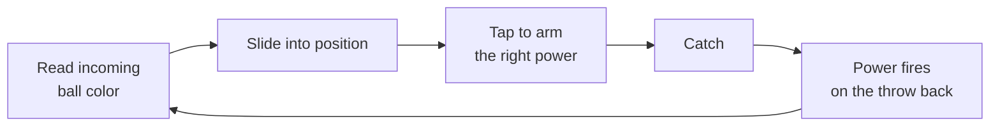

# Chroma Clash — Game Design Doc

Sep 24, 2026 · @Rodrigo

## Overview

Chroma Clash is a fast neon 1v1 ball duel for phones, where a ball never stops bouncing between two players and every catch fires a power from a color-based card deck. It crosses Brazilian queimada (dodgeball) with Pong and a Magic the Gathering-style color system.

**Pillars**

- **Flow:** the ball never stops or resets, and speed only climbs. Players must stay focused the whole duel.
- **Read and react:** the incoming ball's color tells you what's coming; you arm the right answer and catch.
- **Identity through color:** each card color has a distinct personality, so your deck defines your playstyle.
- **Intensity:** neon light, flashes and particles make every catch and hit feel big.

**Platform:** mobile browser, touch-first. It's a website, with nothing to install.

**Scope:** the MVP is a single-player roguelike against AI rivals, running fully client-side with no server. Online 1v1 against real players (lobby and invites) is the follow-up, built on the same game core.

## Core loop and flow

A duel is one continuous rally: the ball is always moving, and the only way to win is to land hits until the rival's HP hits zero.

- **Never resets:** there is no serve to center after a hit. When a player takes a hit, the ball ricochets off them straight back to the attacker, who must catch it again. A good hit can snowball into a combo.
- **Missed catch = damage:** if the ball passes you, you take the damage carried by that throw.
- **Speed ramp:** each duel starts genuinely slow so everything is readable, then speed climbs with every touch and with time. It never drops back within a duel, so the end of a match is pure intensity.
- **Duel length:** about 3 to 5 minutes, driven by the speed ramp rather than a timer.

## Controls

Touch only, with two gestures: slide to move, tap to switch power. Catching is automatic, so the skill is positioning and choosing.

| Action | Gesture | Notes |
| --- | --- | --- |
| Move | Keep a thumb on the screen and slide left or right | Player follows the thumb like a slider |
| Switch power | Tap | Cycles through your 3 slots: 1, 2, 3, back to 1 |
| Catch | Automatic | Happens when the ball reaches you and you're in its path |
| Throw | Automatic | The armed power fires as the ball leaves you |

- **Power slots:** you hold up to 3 powers, shown as three glowing pips at the bottom of the screen.
- **Color feedback:** the whole world (court lines, grid, your glow) shifts to the armed power's color, so you never need to look at the UI.
- **Refill:** a thrown power is spent, and its slot refills with the next card from your deck.
- **Catch position matters:** a center catch is a perfect catch for bonus damage (+25%). An edge catch sends the ball at an angle, which is how you aim. Damage versus aim is a built-in tradeoff.

## Color system

The MVP ships three colors that form a counter triangle; Green and White come after launch.

| Color | Name | Identity | In MVP |
| --- | --- | --- | --- |
| Red | Surge | Raw speed and damage | Yes |
| Blue | Phase | Tricks and deception, hard to read | Yes |
| Black | Void | Drain and sacrifice, power at a price | Yes |
| Green | Growth | Momentum and scaling over a rally | Later |
| White | Aegis | Defense, reflection, slowing the ball | Later |

**Counter triangle:** Red beats Blue, Blue beats Black, Black beats Red. Catching an incoming ball with the power that counters its color cancels the incoming effect and adds bonus damage to your throw.

**Charge and ultimates:** throwing the same color three times in a row unleashes that color's ultimate.

- **Red, Overdrive:** the ball bursts to maximum speed with double damage.
- **Blue, Prism:** the throw splits into three balls, only one of them real.
- **Black, Eclipse:** drains a chunk of the rival's HP to you.

This creates the deck-building tension: a mono-color deck charges ultimates reliably but has a known weakness, while a two-color deck is more flexible but charges less often.

## Cards

The MVP card pool has 12 cards, four per color; damage numbers are starting values to tune in playtesting.

| Card | Color | Rarity | Damage | Effect |
| --- | --- | --- | --- | --- |
| Fastball | Red | Common | 12 | 40% faster throw |
| Heavy | Red | Common | 22 | Slower, leaves a thick wake and shakes the screen |
| Cannon | Red | Rare | 30 | Fast and heavy |
| Overheat | Red | Uncommon | 15+ | More damage the faster the ball is; costs you 5 HP |
| Curve | Blue | Common | 14 | Bends in the air |
| Zigzag | Blue | Uncommon | 14 | Snaps side to side like lightning |
| Ghost | Blue | Rare | 15 | Flickers and fades mid-court |
| Split | Blue | Uncommon | 12 | Throws a decoy ball alongside the real one |
| Leech | Black | Common | 12 | Heals you 10 if it lands |
| Hex | Black | Uncommon | 10 | Rival's next armed power fizzles |
| Sacrifice | Black | Rare | 35 | You lose 15 HP to throw it |
| Shade | Black | Common | 12 | Dims the arena lights briefly for the rival |

Each starter deck holds 8 cards: 6 commons of its color and 2 cards from a neighboring color.

## Shared quests

Quests are races: both players get the same objective, and whoever completes it first takes the reward.

**Rules**

- A quest drops roughly every 30 seconds with a glitch flash and a sound sting. Only one is active at a time.
- Two progress bars (cyan for you, magenta for the rival) race side by side. A bar one step from done pulses.
- First to finish claims the reward instantly and the quest shatters for the other player.
- Unfinished quests expire after about 20 seconds.
- The AI rival chases quests with its own logic, so single-player is still a race.

| Quest type | Example objective |
| --- | --- |
| Color | Land 2 hits with Blue |
| Counter | Counter the rival's color twice |
| Precision | Make 3 perfect catches |
| Node | Send the ball through the glowing node twice |
| Streak | Throw 3 cards of the same color in a row |

| Reward | Effect |
| --- | --- |
| Triple Ball | Next throw splits into three special balls; the rival can catch only one |
| Overcharge | Next 3 throws deal +50% damage |
| Restore | Heal 25 HP |
| Wild Card | A rare card from any color drops into one of your slots |
| Jam | Rival can't arm one of their colors for 10 seconds |

## Roguelike journey

A run is a chain of duels against color-themed rivals; lose once and the run ends.

- **Start:** pick a starter deck (Red, Blue or Black). Your first choice defines your playstyle.
- **Run length (MVP):** 5 duels, the last one a boss.
- **Rivals:** each has a color identity shown before the duel, so you can plan around the counter triangle.
- **Rewards:** after each win, pick 1 of 3 cards. Offers lean toward colors you already play, with an occasional off-color option. Some rewards let you remove a card instead.
- **Recovery:** you carry your HP between duels and recover 30 HP after each win.
- **Deck size:** capped at 15 cards so every addition is a real choice.
- **Later:** meta-progression that unlocks new cards between runs, plus Green and White starter decks.

## Visual and audio direction

Everything is made of light on a black void: pixels, lines and dots, closer to Tron or Geometry Wars than a sports game.

- **Arena:** black background with a thin vector grid that pulses with the rally. Court drawn in thin neon lines.
- **Players:** glowing geometric shapes, a chevron for you (cyan) and a hexagon for the rival (magenta).
- **Ball:** a white-hot pixel core with a long light trail, tinted by the power it carries. It is always the brightest thing on screen.
- **Color shift:** the world takes on your armed power's color. Red, Blue and Black each get a signature neon tone (Black reads as deep violet on the void).
- **Power flashes:** a short full-screen flash (about 80ms) in the power's color on every throw, plus a unique trail per card.
- **Hits:** chromatic glitch tear and a burst of pixel particles from the player hit.
- **Texture:** light CRT scanlines and bloom glow.
- **Audio (stretch goal):** synth blips on catches, pitch rising with ball speed, a bass hit on damage.
- **Accessibility:** a "reduce flashes" setting from day one, since heavy strobing can trigger photosensitive seizures. It also respects the phone's reduced-motion setting.

## Tech stack and roadmap

The game is built with Phaser 3, TypeScript and Vite, deployed as a static site, with Colyseus added later for online 1v1.

| Layer | Choice | Why |
| --- | --- | --- |
| Game engine | Phaser 3 | 2D rendering, input, scenes, particles and glow effects in the browser |
| Language | TypeScript | Keeps cards, colors and quests typed as the system grows |
| Build | Vite | Fast dev server, outputs a plain static site |
| Hosting | Vercel or Netlify | Free static hosting, no server for single-player |
| Multiplayer (later) | Colyseus | Node.js server with rooms and lobbies, authoritative match state |

**Milestones**

1. Neon arena, continuous ball with speed ramp, slide to move, automatic catch.
2. Three power slots with tap-to-cycle and world color shift.
3. Red, Blue and Black cards with the counter triangle and charge ultimates.
4. Shared quests with an AI rival that races for them.
5. Roguelike run: starter decks, 5 duels, card rewards.
6. Juice pass: flashes, particles, glitch hits, reduce-flashes setting.
7. Online 1v1 with lobby and invite codes.

**Open questions**

- Should a hit also bounce the ball back faster, to reward the attacker's combo?
- Does the rival see which power you have armed, or only the color of the thrown ball?
